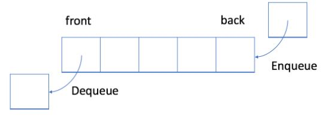
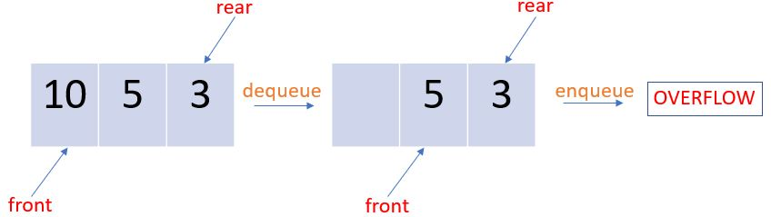

# QUEUES

Queues are a type of Data Structure which follow the FIFO principle (First-in-First-Out). Every Queue is characterized by two parameters called the "front" which is responsible for representing the oldest element in the current queue and "rear" which is responsible for representing the latest element added to the queue.

*Queue Structure:*



### ENQUEUE Operation
Represents the insertion operation in a queue structure. A new element is always added at the end of the Queue. "rear" is updated after the addition.

### DEQUEUE Operation
Represents the deletion operation in a queue structure. The first element is always removed in this DEQUEUE operation. "front" is updated after the deletion.

### Typical Implementation
Consider this code, where we implement the Queue structure as arrays,

```cpp
#include <iostream>
#include <string>
const int max_size = 3;
int front = 0;
int rear = 0;

void display(int data[max_size])
{   std::cout<<"\nCurrent Queue Status = " ;
    for(int i=front;i<rear;i++)
    {   std::cout << data[i]<<" ";
    }
    std::cout<<"\nCurrent Queue  = "<<rear-front;
}

void enqueue(int data[max_size], int element)
{
    if(rear == max_size)
    {   std::cout<<"\nQueue is Full";
    }
    else
    {   data[rear] = element;
        rear++;
        display(data);
    }    
}

void dequeue(int data[max_size])
{
    if(front == rear)
    {   std::cout<<"\nEmpty Queue";
    }
    else
    {   data[front]=0;
        front++;
        display(data);
    }
}

int main()
{   int data[max_size];
    std::cout<<"\nAdding '10' to Queue";
    enqueue(data,10);
    std::cout<<"\nAdding '5' to Queue";
    enqueue(data,5);
    std::cout<<"\nAdding '3' to Queue";
    enqueue(data,3);
    std::cout<<"\nDequeuing...";    
    dequeue(data);
    std::cout<<"\nAdding '6' to Queue";
    enqueue(data,6);
    std::cout<<"\nAdding '7' to Queue";
    enqueue(data,7);
}
```
#### OUTPUT
```

Adding '10' to Queue ...
Current Queue Status = [10]
Current Queue  = 1
Adding '5' to Queue ...
Current Queue Status = [10 5]
Current Queue  = 2
Adding '3' to Queue ...
Current Queue Status = [10 5 3]
Current Queue  = 3
Dequeuing ...
Current Queue Status = [5 3]
Current Queue  = 2
Adding '6' to Queue ...
Queue is Full
Adding '7' to Queue ...
Queue is Full
Exit code: 0 (normal program termination)
```
It is important to note that once the queue is full and we dequeue it, even though the queue length is less than the queue structure size, we can't enqueue any more elements. Once the queue becomes full, we cannot insert the next element even if there is a space in front of the queue. This is a major drawback of the typical queue structure.

*Queue Drawback:*



To overcome this disadvantage, circular queues are used.
